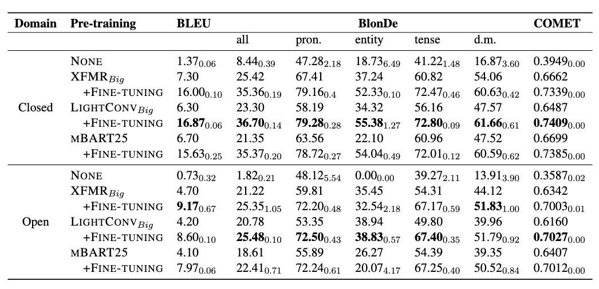

## Challenges in Context-Aware Neural Machine Translation

Authors: [Linghao Jin](https://xiamengzhou.github.io/), [Jacqueline He](https://jacqueline-he.github.io/), [Jonathan May](https://www.isi.edu/directory/jonmay/), [Xuezhe Ma](https://xuezhemax.github.io/)

This repository contains the code for our EMNLP 2023 paper, ["Challenges in Context-Aware Neural Machine Translation"](https://arxiv.org/pdf/2210.14975.pdf). 


## Table of Contents
  * [Quick Start](#quick-start)
  * [Context-aware NMT](#context-aware-nmt)
	+ [Data](#data)
    + [Training](#training)
    + [Evaluation](#evaluation)
  * [P2P NMT](#p2p-nmt)
    + [P2P Data](#p2p-data)
    + [Pre-training](#pre-training)
    + [Fine-tuning](#fine-tuning)
    + [P2P Evaluation](#p2p-evaluation)
  * [Code Acknowledgements](#code-acknowledgements)
  * [Citation](#citation)

## Quick Start

```bash
conda create -n canmt python=3.8
conda activate canmt
pip install -r requirements.txt
```

Note: We use `fairseq 0.9.0`, so as to be compatible with the [Mega](https://arxiv.org/abs/2209.10655) (Ma et al., 2022) architecture. To download the official version:

```python
git clone https://github.com/facebookresearch/mega.git && cd mega
pip install --editable ./
```

## Context-aware NMT

### Data
| Dataset | Lg. pair | Train    | Valid | Test |
|---------|----------|----------|-------|------|
| BWB     | Zh->En   | 9576566  | 2632  | 2618 |
| WMT17   | Zh->En   | 25134743 | 2002  | 2001 |
| IWSLT17 | En<->Fr  | 232825   | 5819  | 1210 |
| IWSLT17 | En<->De  | 206112   | 5431  | 1080 |

### Training

**Run training script**
Train all models for lg. pair *zh->en* implemented in the paper, you can run the following script
```bash
cd sh/zh-en
chmod +x train_all.sh 
./train_all.sh
```
You can configure the hyper-parameters in `train_all.sh` accordingly. Models are saved to `ckpt/`. 

You can also train each model and setting separatively using the following scripts! 
Note: N, M are source and target context sizes, respectively. Following Fernandes et al., our settings are 0-1 (representing the 1-2 in the paper) , and 1-1 (representing the 2-2 in the paper).

**XFMR-based context-aware *concatenation* baseline** (`concat_models`).
```bash
cd sh/zh-en
chmod +x train_concat.sh
./train_concat.sh
```
**Mega-based context-aware *concatenation* baseline** (`concat_models`)
```bash
cd sh/zh-en
chmod +x train_mega.sh
./train_mega.sh
```

### Evaluation
Evaluate all trained models for lg. pair *zh->en* with commonly used NMT metrics as BLEU, COMET and BlonDe, you can run the following script
```bash
cd sh/zh-en
chmod +x generate_all.sh 
./generate_all.sh
```


## P2P NMT

### P2P Data
| Title | Pub. Year | Pub. Year | Avg. Para. Length |
|------------------------------------|-----|----|--------------|
| *Gone with the Wind* (Margaret Mitchell) | 1936 | 3556 | 143 |
| *Rebecca* (Daphne du Maurier) | 1938 | 1237 | 157 |
| *Alice’s Adventure in Wonderland* (Lewis Carroll) | 1865 | 218 | 144 |
| *Foundation* (Isaac Asimov) | 1951 | 3413 | 76 |
| *A Tale of Two Cities* (Charles Dickens) | 1859 | 696 | 225 |
| *Twenty Thousand Leagues Under the Seas* (Jules Verne) | 1870 | 1425 | 117 |

### Pre-training

We use the following backbone architectures for pre-training before fine-tuning on Para2Para dataset:

- **XFMR** (Vaswani et al., 2017), the Transformer-BIG model
- **LIGHTCONV**  (Wu et al., 2019), which replaces the self-attention modules in the Transformer-BIG with fixed convolutions
- **MBART25** (Liu et al., 2020), which is pre-trained on 25 languages at the document level

### Fine-tuning
```bash
cd sh/p2p
chmod +x train_all.sh
./train_all.sh
```
### P2P Evaluation
We provide the scripts to evaluate the pre-trained models on Para2Para without fine-tuning:
```bash
cd sh/p2p
chmod +x generate_pretrained.sh
./generate_pretrained.sh
```

Evaluate the fine-tuned models on Para2Para:
```bash
cd sh/p2p
chmod +x generate_finetuned.sh
./generate_finetuned.sh
```

**Collective results:**


## Code Acknowledgements


## Citation
